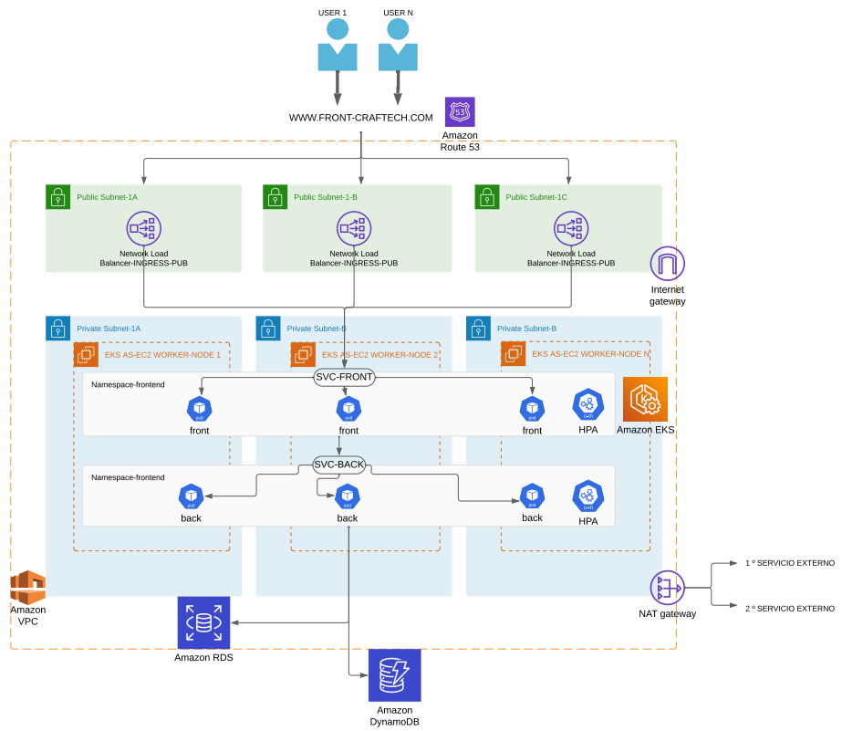

# Diagrama de Red

Arquitectura de la Aplicación Web en AWS
Este proyecto detalla la arquitectura y el despliegue de una aplicación web distribuida en la nube utilizando Amazon Web Services (AWS). El sistema está diseñado para soportar cargas variables, garantizar alta disponibilidad (HA), y manejar una base de datos relacional y otra no relacional. Además, el backend interactúa con dos microservicios externos, se eligio AWS para diagramar no mas.

El diseño de red está representado en el diagrama siguiente:

## Descripción de la Arquitectura

**1-Red y Subredes:**

- La red utiliza una Amazon VPC con subredes públicas y privadas distribuidas en múltiples zonas de disponibilidad (AZs).
- Subredes Públicas:
  - Contienen balanceadores de carga públicos y los puntos de acceso a Internet.
  - Proporcionan acceso al frontend desde Internet mediante un Network Load Balancer (NLB).
- Subredes Privadas:
  - Contienen los nodos de trabajo del cluster EKS y los servicios de backend.
  - Acceden a la base de datos y microservicios externos a través de un NAT Gateway.

**2-Cluster de Kubernetes (Amazon EKS):**
 - El sistema está desplegado en un cluster Amazon EKS, con nodos de trabajo configurados para alta disponibilidad y escalabilidad.
 - Los namespaces separan el frontend (Namespace-frontend) y el backend (Namespace-backend) para un mejor aislamiento.

 **3-Frontend en JavaScript:**

 - Desplegado en el cluster EKS como un servicio de Kubernetes.
 - Expuesto al público mediante un Network Load Balancer.
 - Configurado con Horizontal Pod Autoscaler (HPA) para adaptarse a cargas variables,asegurandonos la posibilidad de cargas variables.

 **4-Backend en Django:**

- Desplegado en el cluster EKS como un servicio en el namespace backend.
- Configurado con Horizontal Pod Autoscaler (HPA) para adaptarse a cargas variables,asegurandonos la posibilidad de cargas variables.
- Accede a:
  - Base de datos relacional: Amazon RDS para PostgreSQL.
  - Base de datos no relacional: Amazon DynamoDB para operaciones rápidas.
  - Microservicios externos: Conectado a dos APIs externas mediante endpoints seguros.

**5-Base de Datos:**

- Relacional: Amazon RDS para PostgreSQL, configurado con redundancia en múltiples zonas de disponibilidad para garantizar HA.
- No relacional: Amazon DynamoDB para datos que requieren consultas rápidas y escalabilidad masiva.  

**6-Balanceo de Carga y Escalabilidad:**

- Network Load Balancer (NLB): Distribuye las solicitudes entrantes entre los pods del frontend y backend.
- Horizontal Pod Autoscaler (HPA): Escala automáticamente los pods del frontend y backend según el uso de CPU y memoria.

**7-DNS y Enrutamiento:**

Amazon Route 53: Gestiona el DNS de la aplicación, redirigiendo los usuarios al frontend con configuraciones de alta disponibilidad.

**8-Seguridad:**

- Grupos de Seguridad (Security Groups): Restringen el acceso entre las subredes públicas y privadas.
- IAM Roles y Policies: Controlan el acceso a DynamoDB.

## Alta Disponibilidad y Escalabilidad
**1-Alta Disponibilidad (HA):**

- Nodos distribuidos en múltiples zonas de disponibilidad.
- Balanceadores de carga garantizan que el tráfico se dirija a los nodos disponibles.
**2-Cargas Variables:**

- Los HPA y cluster Autoscaler en el cluster EKS escalan los servicios según el uso de recursos.