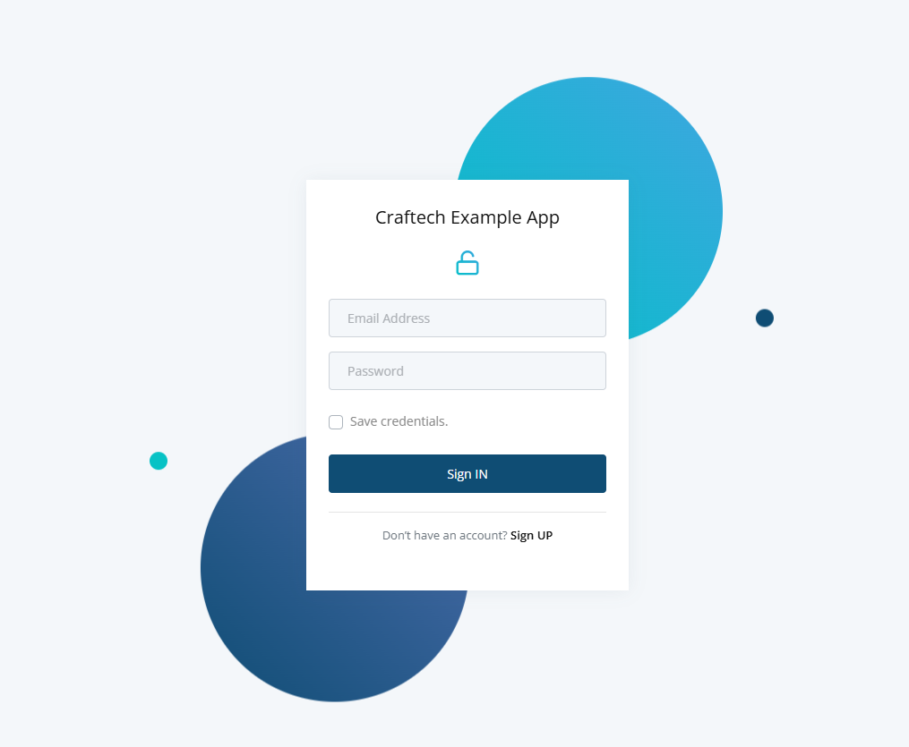

# 2-APPS DOCKERIZADA

**Despliegue Dockerizado** de una Aplicación Django y React.js
Este proyecto contiene una aplicación web compuesta por un backend desarrollado en Django y un frontend en React.js.
Todo el sistema está configurado para ser desplegado usando Docker Compose, lo que permite simplificar la administración de los servicios.

## Estructura del proyecto:

```bash
  .
├── backend/
│   ├── Dockerfile        # Dockerfile del backend Django
│   ├── entrypoint.sh     # Script de inicialización del backend
│   ├── requirements.txt  # Dependencias del backend
│   └── .env              # Variables de entorno para Django
├── frontend/
│   ├── Dockerfile        # Dockerfile del frontend React.js
│   ├── package.json      # Dependencias del frontend
│   └── .env              # Variables de entorno para React.js
├── bd/
│   ├── .env.postgres     # Variables de entorno para PostgreSQL
│   └── data/             # Volumen persistente de la base de datos
├── docker-compose.yml    # Configuración de los servicios
```

## Despliegue Local

Requisitos Previos:
- 1- Clonar el repositorio

```bash
  git clone https://github.com/ElielBloemer/prueba-tecnica.git
  cd prueba-tecnica/
```
- 2-Instalar docker y docker-compose
```bash
  cd /2-DESPLIEGUE_APP_DOCKERIZADA
  bash init-docker.sh
```
## Servicios en el Docker Compose

El archivo docker-compose.yml define los siguientes servicios:

- Base de Datos (PostgreSQL):
  Usa la imagen ligera postgres:12.0-alpine.
  Se configura con variables de entorno desde el archivo bd/.env.postgres.
  Expone el puerto 5432 para conexiones externas (si fuera necesario).

 - Backend (Django):
   Construido usando un Dockerfile multistage para mantener la imagen ligera.
   Expone el puerto 8000.
   Configurado para depender del servicio de base de datos.

 - Frontend (React.js):
   Construido con un Dockerfile multistage similar al backend.
   Expone el puerto 3000.
   Configurado para depender del backend.

### Construcción de las Imágenes:

Se implementaron Dockerfiles multistage para optimizar las imágenes del backend y frontend.

Redes y Dependencias
Se han configurado redes dedicadas para cada servicio:
 - net-db: Red compartida entre el backend y la base de datos.
 - net-app: Red compartida entre el backend y el frontend.
Esto mejora la separación y la seguridad del tráfico interno.

- Construye y levanta los servicios:
```bash
  docker-compose up --build
```

Frontend: http://localhost:3000

Backend: http://localhost:8000

## Probando backend
Registrar usuarios en el Backend,se tuvo que entender el codigo para asi generar usuarios...

Endpoint: http://localhost:8000/api/users/register

Método: POST


```bash
Datos requeridos:
    {
    "password": "YOUR-PASSWORD",
    "email": "YOUR-MAIL",
    "username": "YOUR-USER"
    }
Respuesta esperada:
    {
    "success": true,
    "userID": 2,
    "msg": "The user was successfully registered"
    }
```

## Probando frontend
Asegúrate de que API_SERVER=http://back:8000/api/ apunte al backend, en el archivo frontend/.env

Método: POST

http://localhost:3000

### Pantalla de inicio



### Pantalla cuando ya logueado


## DESPLIEGUE PARA CLOUD(EKS,GKE)
Requisitos Previos:
- 1-Kubernetes Cluster:
Un cluster Kubernetes funcionando (EKS, GKE).
- 2-Kubectl:
  Instalar kubectl y autenticarse contra la api k8s.

**IMPORTANTE!**
En la construccion de la imagen del backend(**ebloemer/back-craf:v2**) se elimino del backend/entrypoint.sh el pedazo de codigo:

```bash
  if [ "$DATABASE" = "postgres" ]
then
    echo "Waiting for postgres..."

    while ! nc -z $SQL_HOST $SQL_PORT; do
      sleep 0.1
    done

    echo "PostgreSQL started"
fi
```
y se creo un **initContainer** en el deployment del backend para ejecutar esa funcion de aguardar 
la inicializacion de la base de datos.

```bash
...
spec:      
      initContainers:
      - name: wait-for-db
        envFrom: 
        - secretRef:
            name: secret-back
        image: busybox
        command: ["sh", "-c"]
        args:
          - |
            #!/bin/sh
            if [ "$DATABASE" = "postgres" ]; then
              echo "Waiting for postgres..."
              while ! nc -z $SQL_HOST $SQL_PORT; do
                sleep 0.1
              done
              echo "PostgreSQL started"
            fi
            ...
```            

### Estructura Manifiestos
```bash
  .
├── backend/
│   ├── deployment.yaml       # Deployment del backend
│   ├── service.yaml          # Service para el backend
│   ├── secret.yaml           # Secret para las credenciales del backend
│   ├── hpa.yaml              # HPA para el backend
│   ├── networkpolicy.yaml    # NetworkPolicy del backend
│   └── namespace.yaml        # Namespace para el backend
├── frontend/
│   ├── deployment.yaml       # Deployment del frontend
│   ├── service.yaml          # Service para el frontend
│   ├── configmap.yaml        # ConfigMap para el frontend
│   ├── hpa.yaml              # HPA para el frontend
│   ├── networkpolicy.yaml    # NetworkPolicy del frontend
│   └── namespace.yaml        # Namespace para el frontend
├── db/
│   ├── deployment.yaml       # Deployment de PostgreSQL
│   ├── service.yaml          # Service para PostgreSQL
│   ├── secret.yaml           # Secret para PostgreSQL
│   ├── networkpolicy.yaml    # NetworkPolicy de PostgreSQL
│   └── namespace.yaml        # Namespace para PostgreSQL
│   └── persistentvolumeclaim.yaml # persistentvolumeclaim para PostgreSQL
│   └── persistentvolume.yaml # persistentvolume para PostgreSQL
```

Configuraciones Importantes:

**1-Backend**:
 - Utiliza un initContainer para esperar que la base de datos esté disponible antes de iniciar.
 - Utiliza un Secret para las credenciales de la base de datos.
 - Configura sondas (liveness, readiness, startup) para garantizar la salud del servicio.

**2-Frontend**:
 - El ConfigMap define las variables de entorno necesarias para conectarse al backend.
 - Las sondas aseguran que el servicio esté disponible antes de aceptar tráfico.

**3-Base de Datos**:
 - Usa un Secret para almacenar las credenciales.
 - La NetworkPolicy asegura que solo los pods del backend puedan acceder al servicio.
 - PersistentVolumeClaim y persistentVolume para persistencia de datos

**4-Autoescalado (HPA)**:
Tanto el frontend como el backend tienen configurado autoescalado basado en uso de CPU y memoria. 

Conexión Entre Componentes
- Base de Datos y Backend:
  El backend se conecta a PostgreSQL utilizando el servicio svc-postgres definido en el namespace base-postgres.
- Backend y Frontend:
  El frontend consume el API del backend usando la URL http://svc-back.backend.svc:8000/api/.
- Políticas de Red:
  Las NetworkPolicy limitan el tráfico solo a las conexiones necesarias entre servicios.

Despliegue de Servicios
```bash
cd /2-DESPLIEGUE_APP_DOCKERIZADA/k8s-manifiestos 
kubectl apply -f back.yaml -f front.yaml -f db.yaml 
```

Si se dispone de un balanceador para poder acceder al servicio del frontend seria se debe crear el ingress 
apuntando al puerto 80 en el svc-front en el namespace frontend, svc-front -n frontend https://DNS-FRONTEND

**IMPORTANTE!** tambien se debe haber creado el usuario en el backend de la misma forma que se genero anteriormente

Probar el acceso de los servicios via port-forward
BACKEND:
```bash
kubectl port-forward svc/svc-back -n backend 8000:8000
```
Forwarding from 127.0.0.1:8000 -> 8000

Forwarding from [::1]:8000 -> 8000


FRONTEND:
```bash
kubectl port-forward svc/svc-front -n frontend 3000:80
```
Forwarding from 127.0.0.1:3000 -> 3000

Forwarding from [::1]:3000 -> 3000

### Observabilidad y metricas

No te olvides de monitorear los servicios!
Para eso puedes hacer uso de herramientas como por ejemplo grafana,prometheus,alertmanager, etc.

### Autor

**Eliel Bloemer**

Si tienes dudas, por favor no dudes en contactarme.😊