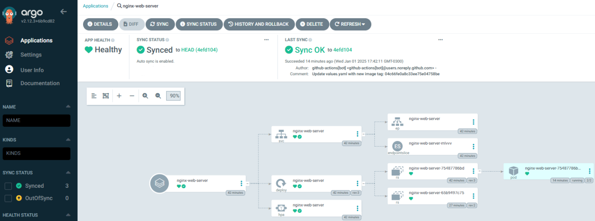
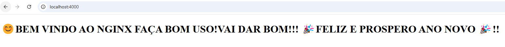

# Pipeline CI/CD para NGINX con Actualización Automática ⚙️

Este proyecto implementa un pipeline CI/CD para construir, publicar y desplegar una imagen de Docker que contiene un servidor NGINX con un archivo index.html predeterminado. El pipeline está configurado para reaccionar a cambios en el archivo index.html y desplegar automáticamente la nueva versión en un servidor remoto.


## Estructura del Proyecto


```bash
.
├── 3-CICD/
│   ├── appset/
│   │   ├── apps/
│   │   │   ├── nginx-web-server/
│   │   │   │   ├── helm/
│   │   │   │   │   ├── templates/
│   │   │   │   │   │   ├── _helpers.tpl
│   │   │   │   │   │   ├── deployment.yaml
│   │   │   │   │   │   ├── externalsecret.yaml
│   │   │   │   │   │   ├── hpa.yaml
│   │   │   │   │   │   ├── ingress.yaml
│   │   │   │   │   │   ├── service.yaml
│   │   │   │   │   │   ├── serviceaccount.yaml
│   │   │   │   │   ├── Chart.yaml
│   │   │   │   │   ├── values.yaml
│   │   │   │   ├── Applicationset.yaml
│   │   │   │   ├── Dockerfile
│   │   │   │   ├── README.md
│   ├── Dockerfile
│   ├── index.html


```
    
## Componentes 🧩

**1. Dockerfile** 🐳

Este Dockerfile utiliza una imagen base de NGINX y copia el archivo index.html para servirlo como contenido estático.

```bash
FROM nginx:alpine
COPY index.html /usr/share/nginx/html/index.html
```

**2. Archivo index.html** 🌐

El archivo HTML que será servido por NGINX:
```bash
<!DOCTYPE html>
<html lang="en">
<head>
    <meta charset="UTF-8">
    <meta name="viewport" content="width=device-width, initial-scale=1.0">
    <title>NGINX Server</title>
</head>
<body>
    <h1>😊BEM VINDO AO NGINX FAÇA BOM USO!VAI DAR BOM!!! 🎉FELIZ E PROSPERO ANO NOVO 🎉!! </h1>
</body>
</html>

```

**3-Helm Chart**
El directorio helm/ contiene los manifiestos necesarios para desplegar el servidor NGINX en Kubernetes:

 - deployment.yaml: Define el despliegue del pod de NGINX.
 - service.yaml: Configura el servicio para exponer el pod.
 - ingress.yaml: Define las reglas de entrada para el acceso externo.
 - hpa.yaml: Configuración del autoscalado horizontal.
 - externalsecret.yaml: configuracion que define el uso de externalsecret que gestionara los secrets de la app,si es que la usa.
 - values.yaml: Contiene los valores dinámicos, como el nombre de la imagen y el tag.

```bash
 repository: "ebloemer/nginx-server"
 tag: "2eab134efabf1776bab62e64b60022faa7ac1d2d"
```

**4-Pipeline CI/CD (ci-cd.yml)** ⚙️

El pipeline implementado en GitHub Actions automatiza el proceso de construcción, publicación y despliegue.

Eventos de Activación:

```bash
on:
  push:
    branches:
      - main
    paths:
      - "3-CICD/index.html"
  workflow_dispatch:    
```
 - Push: Se ejecuta cuando hay cambios en el archivo 3-CICD/index.html en la rama main.
 - Workflow Dispatch: Permite ejecutar manualmente el pipeline desde la interfaz de GitHub.

### Etapas del Pipeline
**1-Checkout del Código**

 - Clona el repositorio en el runner de GitHub Actions

 
```bash
- name: Checkout code
  uses: actions/checkout@v3
```

**2-Inicio de Sesión en Docker Hub** 🐳

Autentica en Docker Hub usando las credenciales almacenadas en los secretos del repositorio:

```bash
- name: Log in to Docker Hub
  uses: docker/login-action@v2
  with:
    username: ${{ secrets.DOCKER_USERNAME }}
    password: ${{ secrets.DOCKER_PASSWORD }}
```

**3-Construcción de la Imagen Docker**

- Construye la imagen Docker basada en el Dockerfile y utiliza el SHA del commit como etiqueta:
```bash
- name: Build Docker image
  run: |
    docker build -t ebloemer/nginx-server:${{ github.sha }} -f 3-CICD/Dockerfile 3-CICD
```

**4-Publicación de la Imagen**

Publica la imagen en Docker Hub para que esté disponible para el servidor remoto:

```bash
- name: Push Docker image
  run: |
    docker push ebloemer/nginx-server:${{ github.sha }}
```

**5-Actualizacion del archivo values.yaml de nginx-webserver**

- Actualiza el archivo values.yaml con el nuevo tag de la imagen:

```bash
- name: Update Helm values file
  run: |
    sed -i "s|tag:.*|tag: \"${{ github.sha }}\"|g" 3-CICD/appset/apps/nginx-web-server/helm/values.yaml

```

**6-Commit y Push del Cambio**

- Realiza un commit del archivo modificado y lo sube al repositorio

```bash
- name: Commit and Push Updated values.yaml
  run: |
    git config user.name "github-actions[bot]"
    git config user.email "github-actions[bot]@users.noreply.github.com"
    git add 3-CICD/appset/apps/nginx-web-server/helm/values.yaml
    git commit -m "Update values.yaml with new image tag: ${{ github.sha }}"
    git push
  env:
    GITHUB_TOKEN: ${{ secrets.GITHUB_TOKEN }}
```

**7-Uso de ApplicationSet-ArgoCD**
- Se decidio usar GitOps para realizar el CD de nginx-webserver para eso se uso argocd-replicacionset con el manifiesto de Applicationset.yaml.
- Cualquier aplicacion desplegada en apps/*/helm sera creada por ArgoCD.
- Crea automáticamente los namespaces especificados y asegura que los recursos sean actualizados.
- Ademas se debe aplicar el manifiesto Applicationset.yaml en su cluster Kubernetes, debe ser aplicado en el namespace argocd

```bash
...
  generators:
  - git:
      repoURL: https://<TOKEN-SECRET>@github.com/ElielBloemer/prueba-tecnica.git
      revision: HEAD
      directories:
      - path: 3-CICD/appset/apps/*/helm
  ...
```

### Para Usarlo debes:
**1-Configurar Secretos en GitHub:** 🔒

  - **DOCKER_USERNAME** y **DOCKER_PASSWORD:** Credenciales de Docker Hub.
  - **SERVER_HOST, SERVER_USER, SERVER_SSH_KEY:** Detalles para acceder al servidor remoto.

**2-Ejecución Automática del pipeline:**

  - Realiza cambios en el archivo **3-CICD/index.html** y realiza un push en la rama **main**.

**3-Ejecución Manual del pipeline:**

Activa el pipeline manualmente desde la interfaz de GitHub Actions.  

**4-Verifica el despliegue:**

- Accede al panel de ArgoCD.
- Verifica que la aplicación se sincronice correctamente con los cambios del repositorio.


### Para probar debes hacer un port-forward:

```bash
kubectl port-forward svc/nginx-web-server -n nginx-web-server 4000:80
Forwarding from 127.0.0.1:4000 -> 80
Forwarding from [::1]:4000 -> 80
```



🚨 **IMPORTANTE!** 🚨

- Debes estar logueado en la api de kubernetes

Con este pipeline, el proceso de despliegue está completamente automatizado,si tienes dudas, por favor no dudes en contactarme.

Muchas gracias por tu tiempo 😊

### Autor

**Eliel Bloemer**
